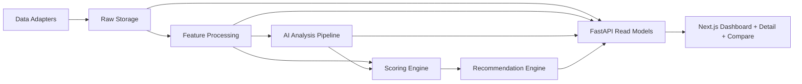

# Architecture

## Overview

The system is split into a presentation-first web app and a data-and-analysis API:

- `apps/web`: Next.js App Router frontend for dashboard, stock detail, comparison, and AI limitations pages
- `apps/api`: FastAPI service for metadata, market data, AI analysis, scoring, recommendations, and refresh orchestration
- PostgreSQL: source of truth for raw inputs, processed features, AI artifacts, scores, and recommendation runs

## High-level flow

## Backend layers

### API layer

- Owns route definitions and response contracts
- Exposes read endpoints for dashboard, stock detail, comparison, and recommendations
- Exposes control endpoints for refresh jobs

### Service layer

- `services/adapters`: data-source abstraction points
- `services/market`: read-model assembly for stock and dashboard views
- `services/ai`: clustering, sentiment, keyword extraction, and thesis generation contracts
- `services/recommendation`: scoring weights and long/short selection logic

### Repository layer

- Encapsulates SQLAlchemy access patterns
- Keeps query logic out of route handlers
- Will expand as ingestion and scoring become live

### Data layer

- SQLAlchemy models define the persistent schema
- Alembic migration owns database creation and evolution
- Raw inputs and derived artifacts are intentionally separate

## Frontend layers

### App Router pages

- `/`: dashboard shell
- `/stocks/[symbol]`: stock detail shell
- `/compare`: comparison shell
- `/ai-limitations`: AI limitations page

### UI composition

- Shared layout shell with premium presentation framing
- Typed fetch utilities in `src/lib`
- Pages consume API responses instead of embedding factor logic

## Daily refresh target design

The intended daily job pipeline is:

1. Refresh market prices
2. Refresh valuation and financial snapshots
3. Refresh announcements and news
4. Cluster and score news sentiment
5. Generate stock-level AI summaries
6. Run transparent factor scoring
7. Select one long and one short recommendation
8. Persist outputs for dashboard consumption

## Explainability design

- Every AI artifact stores model metadata, prompt version, structured payload, and source links
- Every score row stores factor-level components and total score
- Every recommendation row stores rationale, supporting metrics, and source references

