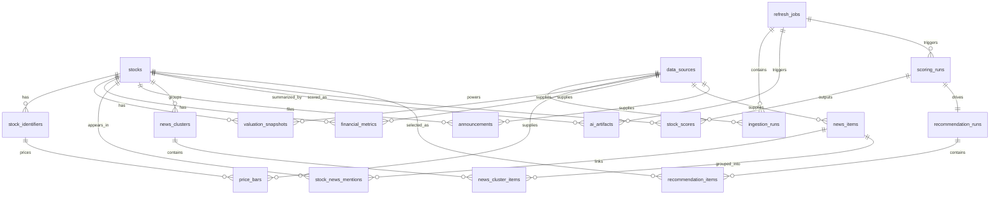

# Data Model

## Design intent

The schema is structured around five layers:

1. Security master and identifiers
2. Raw data ingestion records
3. Processed financial and news features
4. AI-generated explainable artifacts
5. Scoring and recommendation outputs

## Core entities

### Security master

- `stocks`: canonical company-level record for the 15-stock universe
- `stock_identifiers`: A-share, H-share, and US listing identifiers per company

### Source and orchestration

- `data_sources`: adapter/source registry, including mock adapters
- `refresh_jobs`: daily or ad hoc refresh orchestration state
- `ingestion_runs`: per-source ingestion execution records

### Raw and normalized market data

- `price_bars`: historical OHLCV and turnover
- `valuation_snapshots`: PE, PB, PS, EV/EBITDA, market cap, dividend yield
- `financial_metrics`: revenue, profit, margin, ROE, and YoY growth snapshots

### News and announcements

- `news_items`: normalized external news records
- `stock_news_mentions`: stock-to-news relevance linking
- `announcements`: exchange or company announcement records
- `news_clusters`: clustered news topics with sentiment and keyword payloads
- `news_cluster_items`: cluster membership and representative article mapping

### AI and recommendation outputs

- `ai_artifacts`: explainable AI outputs with trace payload and source links
- `scoring_runs`: scoring methodology and weights for a specific date
- `stock_scores`: factor-level scores and ranking
- `recommendation_runs`: long/short selection run metadata
- `recommendation_items`: exactly one long and one short per run

## Relationship sketch

## Traceability fields

Traceability is a first-class requirement in the schema:

- `raw_payload` on ingestion tables preserves adapter payloads
- `source_links` on AI and recommendation tables preserves evidence links
- `trace_payload` on AI and recommendation tables preserves reasoning context
- `score_details` on `stock_scores` preserves factor breakdowns

## Why this schema supports the product

- A-share and Hong Kong identifiers are modeled cleanly
- Adapter outputs can fail independently without breaking page contracts
- AI outputs are stored as auditable artifacts instead of transient strings
- Long and short recommendations are explicit database records, not implicit rankings

